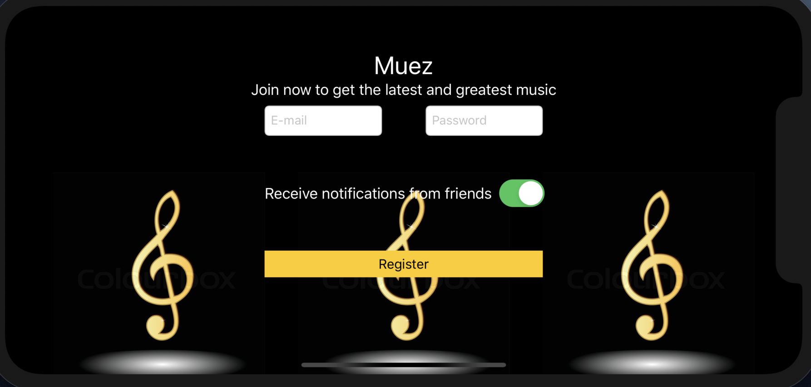
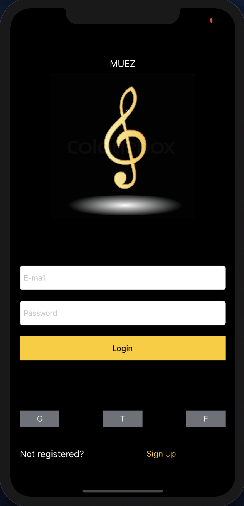

# **Musico**

Continuous integretion method used 

Automated review agent Codecy 

:sunglasses::sunglasses::sunglasses::sunglasses::sunglasses::sunglasses::sunglasses::sunglasses::sunglasses:

This repository will be used for the development of athe iOS app Musico, which will be a grand platform to keep you up to date and entertained by Music from all around the globe, with a great social interaction this being that you are placed in communities with people with your same taste in music.

Features:
- Shared playlist with friends
- Usage of songs during timed events such as stop watch / count down
- Search songs to your heart content

Progress:
- [x] Initialize log in screen
- [ ] Add login functionality
- [ ] Create Dashboard screen to search songs
- [ ] Integrate API to view songs

Preview screenshots:

 </img>
 </img>
