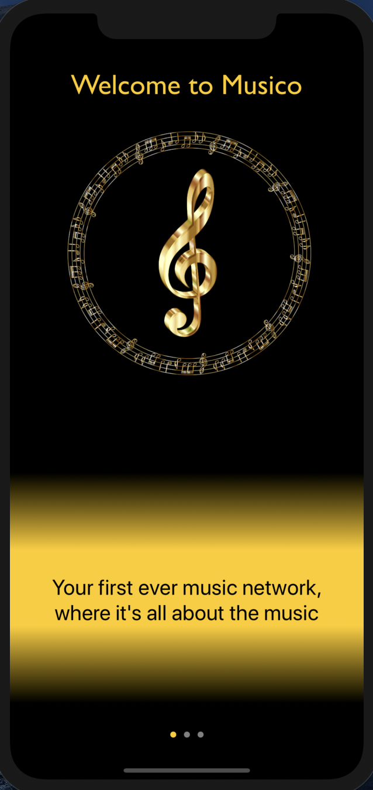
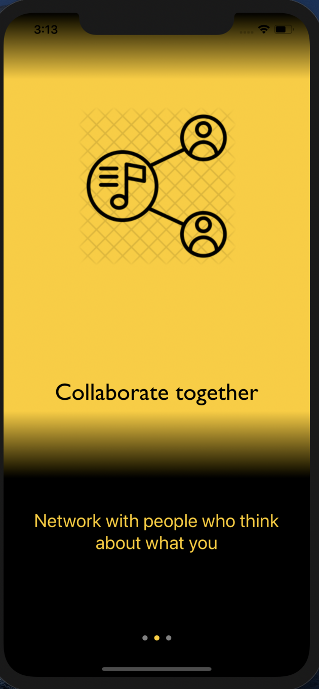
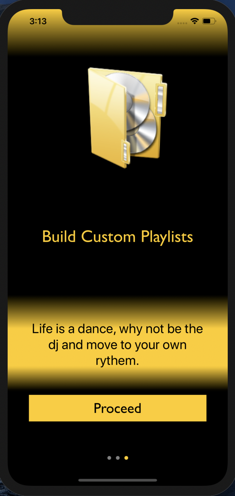
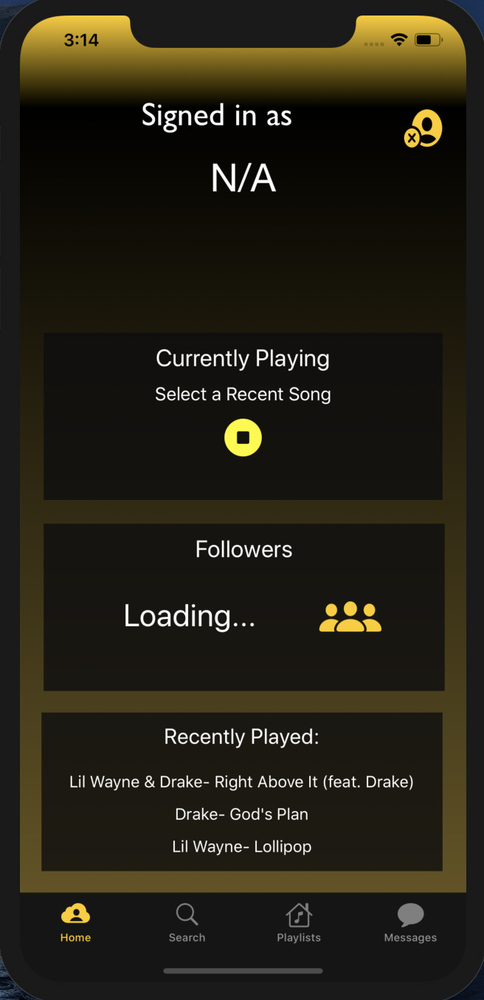
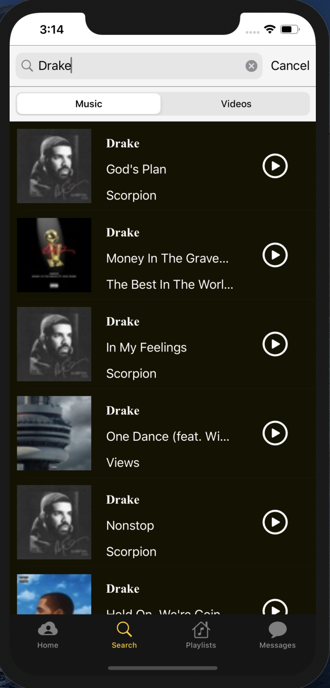
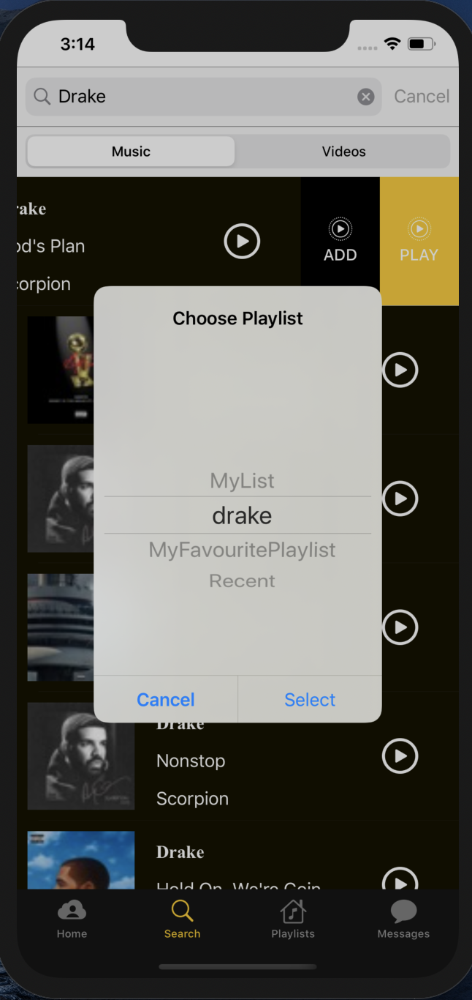
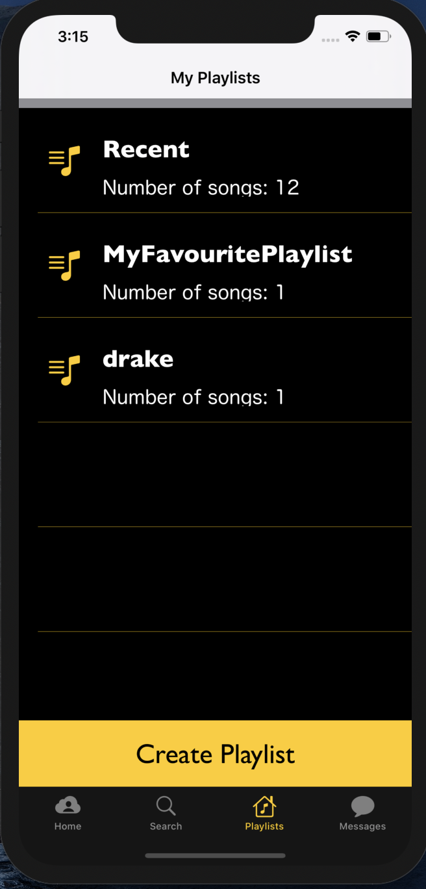
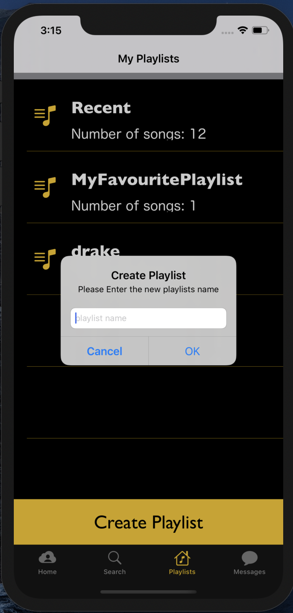

# **Musico**

The iOS app Musico, which will be a grand platform to keep you up to date and entertained by Music from all around the globe, with a great social interaction this being that you are placed in communities with people with your same taste in music.
A world where you have control of music, you get to decide who, when, where and for how long. You are given the power to build a network soley on music as you connect with other people.

Quality assurance tools:
* 
* 
* 

:sunglasses::sunglasses::sunglasses::sunglasses::sunglasses::sunglasses::sunglasses::sunglasses::sunglasses:
Requirements: 
* iOS 13 for all icons to be visible
* Updated google play services as the application utilizes Firebase

Underlying technology:
* Swift majorty
* Objective C

 </img>
 </img>
 </img>

Imagine a tinder just for music where we connect simply for the music. The app features a clean cut dashboard which enables users to see their most recently played songs across the entire application, so you no longer need to scroll through tons of screens and click on multiple options if you know you just want your most recent fix.
 </img>
Ever heard a song on an app and you wanted it but could not find it. Rest assured the app comes with a built in Recent playlist which keep tracks of all the songs you recently played.

 </img>

Search for tons of songs by artist names, from their old heart warming songs to their current cutting edge songs.

 </img>

See a song you like, know it would sound great inside an album. Add that song to one of your own custom playlist albums.

 </img>
 </img>

View all your playlists that you have created and their details. As well as create new playlists.

